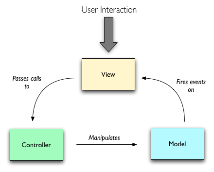
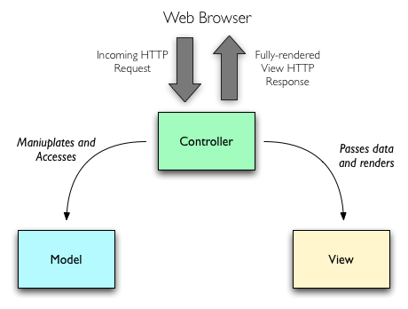
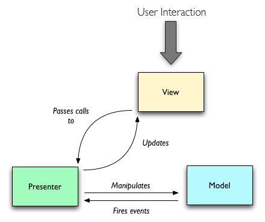
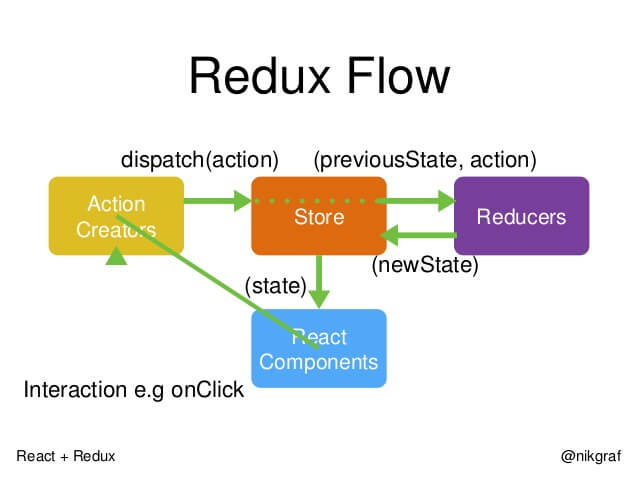

# MVC模式介绍和实践

## MVC定义
- 视图(View)
- 控制器(Controller)
- 模型(Model)

> 是最常见的软件架构之一, 类似的还有(MVP, MVVM);

## 为什么会有MVC?

**解决软件复杂度的问题;**
基于MVC,实现对软件的分层;

## MVC模式是否是固定的?

不是;

区分场景, 典型的前端,后端对MVC的实现有区别;

### 前端更偏重View

### 后端更偏重Model

## MVP

Model-View-Presenter, 主持人

## MVVM

Model-View-ViewModel

- 各部分之间的通信,都是双向的;
- View和Model不发生联系,都通过Presenter/ViewModel传递;
- 主要业务逻辑集中在Presenter/ViewModel;

> 关键区别:是否有数据的双向绑定;

## 目前前端项目对MVC的应用

### redux

设计思想:

- Web应用是一个状态机, 视图和状态是一一对应;
- 所有的状态(`state`),保存在一个对象里面;

### 结合redux的MVC体现

- View层(boxes, buss): `处理UI逻辑`;
- Controller层(actions): `提供接口`: 调用Reqest进行server数据处理; 进行本地数据处理(user); 分发action(包含action.type和action.data);
- Model层(reducers): `提供state`: 根据action.type生成新的state;

> 在各端项目中Controller层和 Model层是可复用的;

### 约定

- Controller层和 Model层 统一单独开发维护; 
- 和后端约定`业务对象`, 比如`金刚狼项目`有:user, staff, company, room, meeting, summary, message;
- View层命名规则: 业务对象名词 + 名词或动词(一个或多个);
- 维护一个`View对照表`, 保持各端项目的统一;

