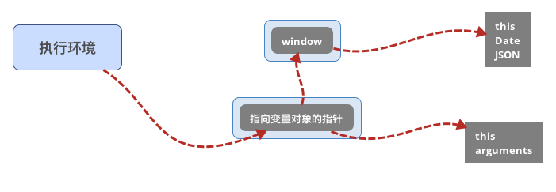
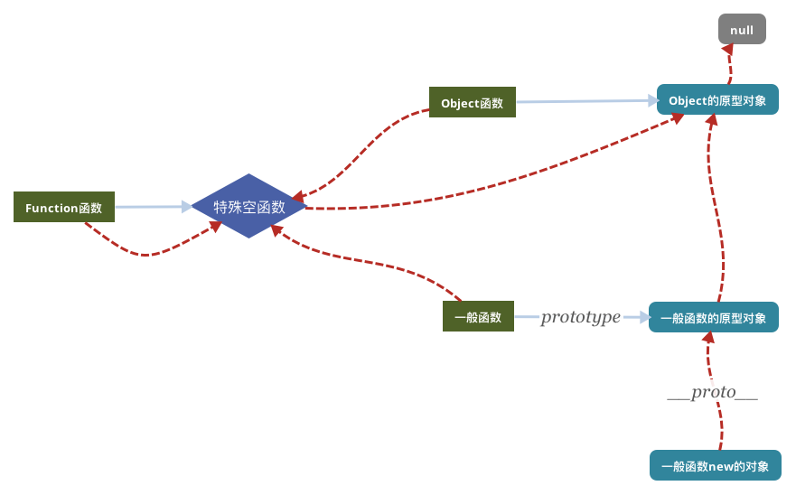

#作用域链&原型链
##js语言的特性
*	面向过程, 
*	面向对象,
*	闭包,
*	内存泄露
*	... ...

**_由底层语言机制决定_**

##js脚本的加载过程
1.	下载;
2.	预处理;
3.	顺序执行;

###函数执行的三种方式
*	var obj = new func();
 //this指向一个新对象. 这种方式，内部初始化一个对象，同时this指针指向该对象，最后返回this指向的对象给obj；

*	obj.func(); //this指向obj

*	func();//this指向window

##作用域链

###代码执行的三个概念
*	执行环境, 负责维护作用域链和活动对象

*	作用域链, 指向变量对象的一个链表

*	变量对象(活动对象), 包含执行过程中产生的变量

###作用域链demo1
```
//对name的访问, 那种效率更高
var name = '张三';

function hello() {
	console.log(name);
	console.log(window.name);
	console.log(this.name);
}
hello();
```

###作用域链demo2

```
var name = '张三';
var age = 30;
var count = 100;

function Man(name, age) {
	var count = 0;
	this.name = name;
	this.age = age;
	this.display = function() {
		count++;
		var func1 = function() {
			console.log('func1:', this.name);
		};
		func1();

		console.log('display:', this.name);
		return count;
	}
}

var man = new Man('李四', 40);
var currentCount = man.display();
console.log('currentCount1:', currentCount);

Man('王五', 50);
currentCount = display();
console.log('currentCount2:', currentCount);

currentCount = man.display();
console.log('currentCount3:', currentCount);
```

##原型链

###原型链特点
*	支持了面向对象开发模式
*	显示原型指针`prototype`, 任何函数都有(除了特殊Empty函数)
*	隐式原型指针`__proto__`, 任何对象都有(除了null, undefined, NaN)
*	特殊空函数只有`__proto__`
*	Object的原型对象的`__proto__`指向null

###原型链demo
```
Function instanceof Object //任何对象都是Object的实例

Object instanceof Function //任何函数都是Function的实例

Date.__proto__ === Function.prototype

Function.__proto__ === Function.prototype
```

##变量访问
*	一般变量的访问, 依赖”作用域链"
*	成员变量的访问, 依赖”原型链”

##性能优化
*	缩短变量的访问路径;(多次用到的外部变量,使用局部变量)
*	减少闭包;
