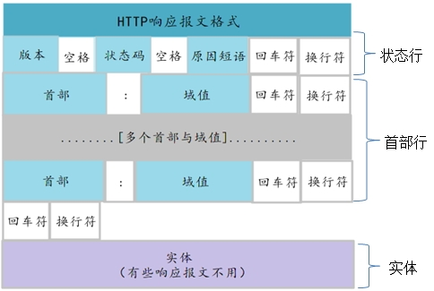

# 认识HTTP协议
## Web及网络基础
### 从在浏览器输入地址到页面渲染完成都经历了什么

1. 带着要访问的地址访问DNS服务器请求ip地址
2. DNS服务器查询后返回ip地址
3. 根据拿到的ip地址访问Web服务器
4. 返回相应资源
5. 客户端渲染

### 如何理解协议？
我的理解：**双方**为了达到某些目的而设定的需要共同遵守的**规则**。
### 网络基础TCP/IP
通常使用的网络是在TCP/IP协议族的基础上运作的，HTTP属于它内部的一个自子集。

有说法认为TCP/IP是把与互联网相关联的协议集合起来的总称。也有说法认为，TCP/IP是指TCP和IP两种协议。也有说法认为TCP/IP是在IP协议的通信过程中，使用到的协议族的统称。

#### TCP/IP通信传输流
TCP/IP协议族里最重要的一点就是分层。TCP/IP协议族按层次分别分为以下4层：

1. 应用层
2. 传输层
3. 网络层（又名网络互连层）
4. 数据链路层（又名链路层，网络接口层）

##### 应用层
应用层决定了向用户提供应用服务时通信的活动。

TCP/IP协议族内预存了各类通用的应用服务。比如，FTP和DNS服务。HTTP协议也属于该层。

##### 传输层
传输层对上层应用层提供处于网络连接中的两台计算机之间的数据传输。

在传输层有两个性质不同的协议：TCP和UDP

TCP协议为确保数据能到达目标，采用三次握手策略。

##### 网络层
网络层用来处理在网络上流动的数据包。数据包是网络传输的最小数据单位。该层规定了通过怎样的路径（所谓的传输线路）到达贵方计算机，并把数据包传送给对方。

索契的作用就是在众多的选项内选择一条传输路线。

##### 链路层
用来处理链接网络的硬件部分。包括控制操作系统、硬件的设备驱动、NIC（Network InterFace Card， 网络适配器，即网卡）及光纤等物理课件部分，还包括连接器等一切传输媒介。硬件上的范畴均在链路层的作用范围之内。

#### 负责域名解析的DNS服务
DNS（Domain Name System）服务是后台HTTP协议一样位于应用层的协议。它提供域名到IP之间的解析服务。

#### 各种协议与HTTP协议的关系

#### URI和URL
URI是Uniform Resource Identifier的缩写。

1. Uniform：规定统一的格式可方便处理多重不同类型的资源，而不用根据上下文环境来识别资源指定的访问方式。另外，加入新增的协议方案也更容易
2. Resource：资源的定义是“可表示的任何东西”。除了文档文件、图像或服务等能够区别于其他类型的，全部可作为资源。另外，资源不近可以是单一的，也可以是多数的集合体。
3. Identifier：表示可表示的对象。也成为标识符。

综上所述，URI就是由某个协议方案表示的资源的定位标识符。协议方案是指访问资源所使用的协议类型名称。

URI用字符串表示某一互联网资源，而URL表示资源的地点（互联网上所处的位置）。可见URL是URI的子集

绝对URI的格式：http://  user:pass  @  www.example.com  :80  /dir/index.html  ?  uid=1  #ch1

## 了解HTTP协议
### 作用
HTTP协议和TCP/IP协议族内的其他众多协议相同，用于客户端和服务器之间的通信。
### 方式
通过请求和相应的交换达成通信。

HTTP协议规定，请求从客户端发出，最后服务端相应该请求并返回。换句话说，**肯定是先从客户端开始建立通信的，服务器端在没有接收到请求之前不会发送相应**。
### 特点
1. 无状态协议，不对发过的请求或相应做持久化处理
2. 先从客户端开始建立通信的，服务器端在没有接收到请求之前不会发送相应

### 请求和相应报文格式
HTTP 请求报文由请求行、请求头部、空行和请求包体 4 个部分组成，如下图所示：

HTTP 响应报文由状态行、响应头部、空行和响应包体 4 个部分组成，如下图所示：

### HTTP方法
- GET：获取资源
- POST：传输实体主体
- PUT：传输文件。因本身不带验证机制，有安全隐患，一般不使用。如果配合Web应用的验证机制，或架构设计采用REST标准的，可能会开放使用
- HEAD：获得报文首部
- DELETE：删除文件。因本身不带验证机制，有安全隐患，一般不使用。如果配合Web应用的验证机制，或架构设计采用REST标准的，可能会开放使用
- OPTIONS：询问支持的方法
- TRACE：追踪路径
- CONNECT：要求用隧道协议连接代理

### 持久连接节省通信量
初始的HTTP协议版本中，每进行一次HTTP通信就要断开一次TCP连接，会增加通信量的开销。
#### 持久链接
HTTP/1.1和一部分的HTTP/1.0 实现了持久连接，只要任意一端没有明确提出断开连接，则保持TCP连接状态。
### 使用Cookie的状态管理
HTTP本身是无状态的协议，这样无法保持用户的登录状态。因此引入Cookie概念。

Cookie会根据从服务器端发送的响应报文内的一个叫做Set-Cookie的首部字段信息，通知客户端保存Cookie。下次请求时，客户端会自动在请求报文中加入Cookie信息

### 编码提升传输速率
#### 报文主体和实体主体的差异
- 报文：是HTTP通信中的基本单位，由8位组字节流组成，通过HTTP通信传输
- 实体：作为请求或响应的有效载荷数据被传输，其内容由实体首部和实体主体组成。

#### 提升速率手段
- 压缩传输的内容编码
	- gzip(GNU zip)
	- compress(UNIX系统的标准压缩)
	- deflate(zlib)
	- identity(不进行编码)
- 分割
- 发送多种数据的多部分对象集合
	- multipart/form-data
	- multipart/teranges 

### 状态码
#### 2XX 成功
- 200 OK 请求成功（其后是对GET和POST请求的应答文档。）
- 202 Accepted 供处理的请求已被接受，但是处理未完成。
- 204 No Content
- 206 Partial Content

#### 3XX 重定向
- 301 Moved Permanently 所请求的页面已经转移至新的url。
- 302 Found 所请求的页面已经临时转移至新的url。
- 303 See Other 所请求的页面可在别的url下被找到。
- 304 Not Modified 未按预期修改文档。客户端有缓冲的文档并发出了一个条件性的请求（一般是提供If-Modified-Since头表示客户只想比指定日期更新的文档）。服务器告诉客户，原来缓冲的文档还可以继续使用。
- 307 Temporary  Redirect

#### 4XX 客户端错误
- 400 Bad Request 服务器未能理解请求。
- 401 Unauthorized 被请求的页面需要用户名和密码。
- 402 Payment Required 此代码尚无法使用。
- 403 Forbidden 对被请求页面的访问被禁止。
- 404 Not Found 服务器无法找到被请求的页面。
- 405 Method Not Allowed 请求中指定的方法不被允许。

#### 5XX 服务器错误
- 500 Internal Server Error 请求未完成。服务器遇到不可预知的情况。
- 501 Not Implemented 请求未完成。服务器不支持所请求的功能。
- 502 Bad Gateway 请求未完成。服务器从上游服务器收到一个无效的响应。
- 503 Service Unavailable  请求未完成。服务器临时过载或当机。
- 504 Gateway Timeout 网关超时。

### HTTP首部
#### 通用首部字段
- Cache-Control :控制缓存的行为
- Connection :逐跳首部,连接的管理
- Data :创建报文的日期事件
- Pragma :报文指令
- Trailer :报文末端的首部一览
- Transfer-Encoding :指定报文主体的传输编码方式
- Upgrade :升级为其他协议
- Via :代理服务器的相关信息
- Warning :错误通知
#### 请求首部字段
- Accept :用户代理可处理的媒体类型
- Accept-Charset :优先的字符集
- Accept-Encoding :优先的内容编码
- Accept-Language :优先的语言
- Authorization :Web认证信息
- Expect :期待服务器的特定行为
- From :用户的电子邮箱地址
- Host :请求资源所在服务器
- If-Match :比较实体标记
- If-Modified-Since :比较资源的更新时间
- If-None-Match :比较实体标记 ETag
- If-Range :资源未更新时发送实体Byte的范围请求
- If-Unmodified-Since :比较资源的更新时间
- Max-Forwards :最大传输逐跳数
- Proxy-Authorization :代理服务器要求客户端的认证信息
- Range :实体的字节范围请求
- Referer :对请求中URI的原始获取方
- TE :传输编码的优先级
- User-Agent :HTTP客户端程序的信息
#### 响应首部字段
- Accept-Ranges :是否接受字节范围请求
- Age :推算资源创建经过时间
- ETag :资源的匹配信息
- Location :令客户端重定向至指定URI
- Proxy-Authenticate :代理服务器对客户端的认证信息
- Retry-After :对再次发起请求的时机要求
- Server :HTTP服务器的安装信息
- Vary :代理服务器缓存的管理信息
- WWW-Authenticate :服务器对客户端的认证信息
#### 实体首部字段
- Allow :资源可支持的HTTP方法
- Content-Encoding :实体主体适用的编码方式
- Content-Language :实体主体的自然语言
- Content-Length :实体主体的大小,单位为字节
- Content-Location :替代对应资源的URI
- Content-MD5 :实体主体的报文摘要
- Content-Range :实体主体的位置范围
- Content-Type :实体主体的媒体类型
- Expires :实体主体过期的日期时间
- Last-Modified :资源的最后修改日期

### HTTP的不足
- 通信使用明文,不加密,内容可能会被窃听
- 不验证通信方的身份,有可能遭遇伪装
- 无法证明报文的完整性,有可能已遭篡改

## 确保安全的HTTPS
HTTP + 加密 + 认证 + 完整性保护 = HTTPS

HTTPS并非一种新的协议，只是HTTP通信接口部分用SSL和TLS协议代替而已
### 通信机制

图中简述了HTTPS的通信步骤，具体分为以下：

1. 客户端通过发送Client Hello报文开始SSL通信。报文中包含客户端支持的SSL的制定版本、加密组件列表(加密算法，密钥长度等)；
2. 服务器可进行SSL通信时，会以Server Hello报文作为应答。和客户端一样，在报文中包含SSL版本以及加密组件。服务器的加密组件内容是从接收到的客户端加密组件内筛选出来的；
3. 之后服务器发送Certificate报文。报文中包含公开密钥证书；
4. 最后服务器发送Server Hello Done报文通知客户端，最初阶段的SSL握手协商部分结束；
5. SSL第一次握手结束之后，客户端以Client Key Exchange报文作为回应。报文中包含通信加密中使用的一种被称之为Pre-master secret的随机密码串。该报文已经用步骤3中的公开密钥进行加密；
6. 接着客户端继续发送Change Cipher Spec报文。该报文会提示服务器，在此报文之后的通信会采用Pre-master secret密钥加密；
7. 客户端发送Finished报文。该报文包含连接至今全部报文的整体校验值。这次握手协商是否能够成功，要以服务器是否能够正确解密该报文作为判定标准；
8. 服务器同样发送Change Cipher Spec报文；
9. 服务器同样发送Finished报文；
10. 服务器和客户端的Finished报文交换完毕之后，SSL连接就算建立完成。当然，通信会收到SSL的保护。从此处开始进行应用层协议的通信，即发送HTTP请求；
11. 应用层协议通信，即发送HTTP响应；
12. 最后由客户端断开连接。断开连接时，发送close_notify报文。这步之后再发送TCP FIN报文来关闭与TCP的通信。

下图是从仅使用服务器端的公开密钥证书(服务器证书)建立HTTPS通信的整个过程的图解。

### 问题
1. 即当使用SSL时，它的处理速度会变慢。SSL的慢分两种。一种是通信慢，另一种是指由于大量消耗CPU及内存等资源，导致处理速度变慢。和使用HTTP相比，网络负载可能会变慢2到100倍。
2. SSL必须进行加密处理。在服务器和客户端都需要进行加密和解密的运算处理，这样会比HTTP更多地消耗服务器和客户端的硬件资源，导致负载增强。

因此，虽然HTTPS安全可靠，但是不是所有的Web网站都要一直使用HTTPS。
